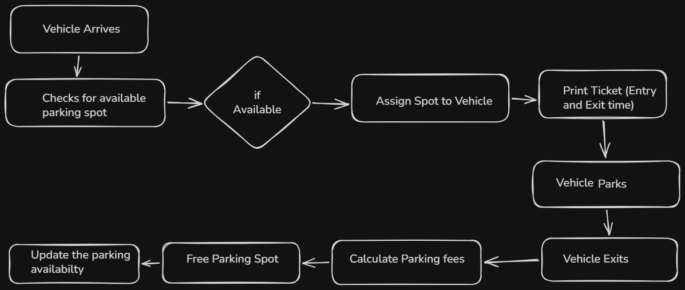
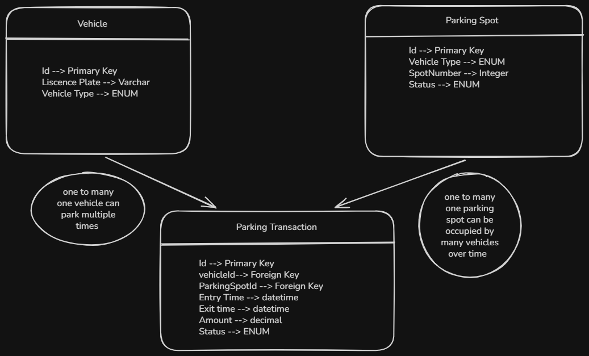
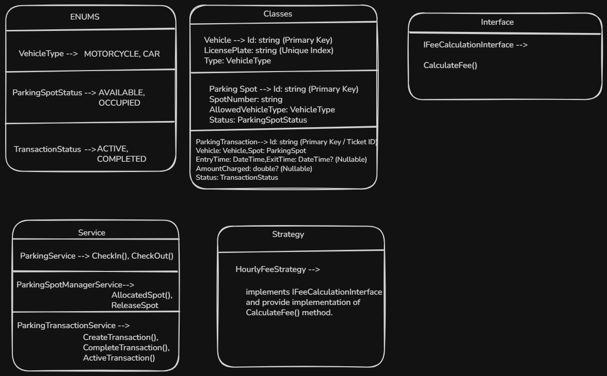

FLOW of Project 

Database Diagram

Class Diagram

Complete flow of project (Vehicle Arrives)
-------------------------------------------

Vehicle Arrives  --> ParkingService.checkIn() --> ParkingSpotManagerService.getAvailableSpot()

--> ParkingSpotManagerService.allocateSpot() --> ParkingSpot.occupy()

--> ParkingTransactionService.createTransaction() --> ParkingTransaction Returned

(Vehicle Exits)
----------------

ParkingService.checkOut() --> TransactionService.getActiveTransaction()

--> HourlyFeeStrategy.calculateFee() --> Transaction.completeTransaction()

--> SpotManager.releaseSpot() --> ParkingSpot.release()